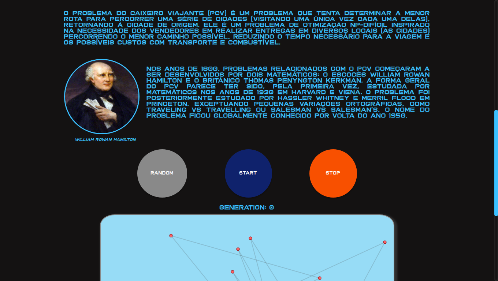

# Rowan Viajante

**Número da Lista**: 6 
**Conteúdo da Disciplina**: Projeto Final 

## Alunos
|Matrícula | Aluno |
| -- | -- |
| 17/0062686 |  Pedro Rodrigues Pereira |
| 17/0008371 |  Daniel de Sousa Oliveira Melo Veras |

## Sobre 
O projeto tem como objetivo demonstrar o problema do "**Caixeiro viajante**". Gerando assim *mapas* aleatórios e proporciando a visualização da resolução dos mesmos.

## Screenshots

### Pagina inicial

### Contexto do problema

### Campo gerado aleatoriamente

### Solução do problema

## Instalação 
**Linguagem**: Javascript e HTML 
 
O projeto não demanda instalação. Basta abrir o arquivo **index.html**, presente na raiz no projeto.

## Uso 

Após abrir o arquivo **index.html** presente na raiz do projeto, se faz necessário realizar a rolagem até o *mapa* gerado aleatoriamente. Neste cenário é possivel clicar para visualizar a solução ou gerar um novo campo.
